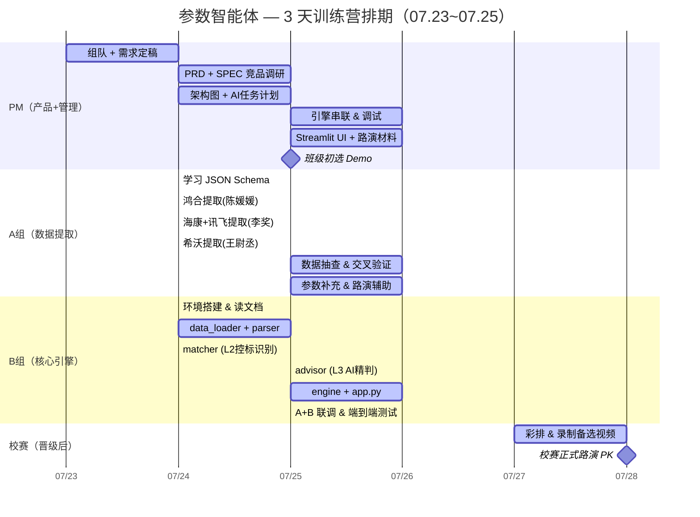

# 01 — 团队分工 & 排期计划

> 版本：v3.0 | 日期：2026-07-25  
> 总人数：5 人（PM 1 + A组数据提取 3 + B组核心引擎 2）  
> AI 工具：Kooky（Claude Code），组长 $100 额度，组员各 $20

---

## 1. 角色与人员

| 角色 | 人数 | 姓名 | 账号 | 一句话职责 |
|------|------|------|------|-----------|
| **项目经理（PM）** | 1 | — | — | 目标拆解、计划推进、任务整合、材料提交、路演统筹 |
| **A 组：数据提取** | 3 | 陈媛媛、李奖、王尉丞 | yychen70、jiangli11、wcwang22 | 从知识库3提取真实参数 → 统一 JSON |
| **B 组：核心引擎** | 2 | 覃宝洋、许文卓 | byqin、wzxu7 | Python 引擎开发（parser + matcher + loader） + Streamlit |
| **PM 兼任** | 1 | PM | — | 内容呈现：路演材料、AI 协作记录、PPT |

---

## 2. 3 天排期甘特图

> **训练营周期**：07.23 – 07.25（3 天）→ 班级初选 → 第一名晋级 07.28 校赛。



### 串行/并行标注

```
07.23 (Day 1)            07.24 (Day 2)                   07.25 (Day 3)              07.27-28 (晋级)
─────────────────────────────────────────────────────────────────────────────────────────────────

[PM] ──组队+PRD──▶ ──竞品调研+SPEC──▶ ──架构+任务计划──▶ ──引擎调试──▶ ──UI+材料──▶ ★班级初选
                        │                                      │
[A组]                   ├─ Schema学习 ──▶ 3人并行提取 ──▶     ├── 交叉验证 ──▶ 补充辅助
                        │   (0.25d串行)     (0.25d并行)       │    (串行)
                        │                                      │
[B组]                   ├─ 环境搭建 ──▶ 并行开发 ──────────▶  ├── AI+UI ──▶ 联调
                        │   (串行)      L1/L2/loader          │   (串行)     ★端到端跑通
                        │               (3文件并行)            │
                                                                              ★校赛(07.28)
```

| 标记 | 含义 |
|------|------|
| ═══ | 串行依赖（前一阶段未完成，后一阶段无法开始） |
| ∥ | 并行执行（两组互不依赖，同时进行） |
| ★ | 里程碑节点 |

---

## 3. 今日（07.25）任务分配

### 📦 A 组：数据提取（3 人）

**目标**：从 `知识库3/` 提取真实参数，做成统一 JSON。

**必读文档**：
1. `data/README.md` ⚠️ **最重要——JSON Schema 契约，不按这个格式 B 组读不到数据**
2. `02-PRD.md` — 了解产品全貌、用户场景
3. `05-SPEC.md` — 了解 Demo 范围、功能规格

| 成员 | 负责厂商 | 源数据 | 处理难度 | 产出文件 |
|------|---------|--------|---------|---------|
| 陈媛媛 | 鸿合 | `知识库3/鸿合/` Markdown 文件 | 🟢 最易 | `data/competitors/honghe.json`（覆盖现有 Mock） |
| 李奖 | 海康 + 讯飞 | `知识库3/海康/` Markdown + `知识库3/讯飞数据.docx` | 🟢 容易 | `data/competitors/haikang.json`（新建）+ `data/xunfei/xunfei.json`（覆盖现有 Mock） |
| 王尉丞 | 希沃 | `知识库3/希沃/` xlsx + docx | 🟡 需先解出文本 | `data/competitors/xiwo.json`（覆盖现有 Mock） |

**做法**：
1. 打开源文件，把参数文本贴给 Kooky
2. 告诉 Kooky："按照 `data/README.md` 里的 Schema，把这些参数转成 JSON"
3. 抽查 5 条：对照原文，确认数值和单位没搞错
4. 选 12-15 条最核心的硬件参数（屏幕/触控/摄像/音频/接口/OPS），多余的软件参数标注为可选

---

### 💻 B 组：核心引擎（2 人）

**目标**：用现有 Mock JSON 把第一关和第二关的 Python 代码跑通。

**必读文档**：
1. `data/README.md` ⚠️ **JSON Schema 契约 + 底部有 Python 读法示例**
2. `05-SPEC.md` §1.3（控标识别算法）、§1.4（参数匹配算法）— 伪代码就是开发规格
3. `04-technical-design.md` — 系统架构、核心算法、数据格式

**环境准备**：
```bash
pip install streamlit pandas openpyxl python-docx pdfplumber
```

| 成员 | 文件 | 功能 | 说明 |
|------|------|------|------|
| 覃宝洋 | `src/data_loader.py` | 封装 JSON 读取 | 按 `data/README.md` 底部的 Python 示例写 |
| 许文卓 | `src/parser.py` | `extract_value()` + `normalize_unit()` + `keyword_overlap()` + `quick_match()` | 第一关程序粗筛 |
| 许文卓 | `src/matcher.py` | `identify_controller()` | 第二关控标方识别 |

**不阻塞**：Mock JSON 和真实 JSON 格式完全一致。A 组数据到位后，B 组只换文件，代码一行不改。

---

## 4. 两条线的依赖关系

```
A 组（数据提取）                  B 组（核心引擎）
─────────────                   ─────────────
用 Mock JSON 格式作为模板        用 Mock JSON 写代码
      │                              │
      ▼                              ▼
从真实文件提取 → 覆盖 Mock JSON    代码调通、自测通过
      │                              │
      └──────────┬───────────────────┘
                 ▼
          真实 JSON 替换 Mock
          引擎读新数据 → 端到端跑通 ✅
```

**互不阻塞**。唯一共享的契约是 `data/README.md`。

---

## 5. 每日站会议程（≤ 10 分钟）

1. 每人 1 句话：昨天做了什么、今天要做什么
2. 有卡点吗？
3. PM 更新进度

---

## 6. 额度管理

| 角色 | 人数 | 人均额度 | 预估消耗 |
|------|------|---------|---------|
| PM | 1 | $20 | $5 |
| A 组 | 3 | $20×3 | $15 |
| B 组 | 2 | $20×2 | $25 |
| **组长储备** | 1 | $100 | $40 应急 |
| **合计** | 5 | **$260** | **$85** |
