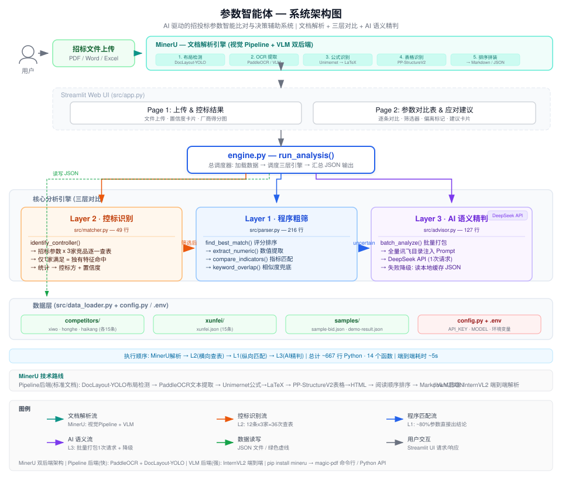

# 04 — 技术方案设计

> 版本：v1.0 | 日期：2026-07-24  
> 原则：简单 > 优雅，能跑 > 完美 | 4天交付

---

## 1. 技术选型

| 层 | 选型 | 版本 | 理由 |
|----|------|------|------|
| 编程语言 | Python | 3.10+ | 上手最快，AI 生成质量最高 |
| UI 框架 | Streamlit | latest | Python 原生，无需 HTML/CSS/JS |
| AI 模型 | DeepSeek v4-flash | latest | API 调用，批量打包降低成本 |
| 数据存储 | JSON 文件 | - | 免安装，直接 `json.load()` |
| 文档解析 | MinerU（OpenDataLab） | latest | 视觉 Pipeline + VLM 双后端，PDF/Word/Excel → Markdown/JSON |
| 版本管理 | Git（GitHub） | - | 代码协作 |

> **MinerU 技术路线**：不走传统 PDF 文本层解析（如 pdfplumber），而是将页面渲染为图像 → 视觉模型理解版面 → 语义级提取。Pipeline 后端（5 阶段）：DocLayout-YOLO 布局检测 → PaddleOCR 文本提取 → Unimernet 公式→LaTeX → PP-StructureV2 表格→HTML → 阅读顺序排序 → Markdown/JSON。VLM 后端：InternVL2 端到端解析，复杂版面更强。`pip install mineru` 即可集成。

---

## 2. 系统架构



> 上图展示了完整的三层对比架构：Streamlit UI → engine.py 总调度 → [L2 控标识别 → L1 程序粗筛 → L3 AI 精判] → JSON 数据层。  
> **执行顺序**：L2 先横向查表判定控标方，L1 再纵向逐条匹配讯飞参数，最后 L3 对 uncertain 项批量调 AI。

### 文件职责

| 文件 | 行数 | 核心函数 | 依赖 |
|------|------|---------|------|
| `config.py` | 4 | 环境变量加载 | `.env` |
| `data_loader.py` | 35 | `load_competitors()`, `load_xunfei()`, `load_bid()` | 文件系统 |
| `parser.py` | 216 | `find_best_match()`, `quick_match()`, `extract_numeric()`, `compare_indicators()`, `keyword_overlap()` | 无 |
| `matcher.py` | 45 | `identify_controller()` | parser |
| `advisor.py` | 127 | `batch_analyze()` | config, DeepSeek API |
| `engine.py` | 90 | `run_analysis()` | 全部模块 |
| `app.py` | 150 | `page_upload()`, `page_compare()` | engine |
| **总计** | **~667** | **14 个函数** | |

### 关键技术决策

| 决策 | 方案 | 理由 |
|------|------|------|
| AI 调用 | 批量打包 1 次请求 | 避免 N+1，12 条仅 1 次 API 调用 |
| 降级设计 | 成功缓存 → 失败读缓存 | API 不可用时系统不崩溃 |
| 参数匹配 | keyword_overlap 评分 + category/unit 加成 | 修复 unit-only 错配 Bug |
| Prompt 工程 | 15 条讯飞全量目录注入 | 避免 AI 被错配参数误导 |
| 数据解耦 | data_loader 抽象层 | 换存储只改 loader，引擎不动 |

---

## 3. 核心算法：三层对比

### 3.1 第一层：程序粗筛（Parser + Quick Match）

**目的**：把能直接比的都处理掉，减少 AI 调用。

```python
def quick_match(bid_item, our_item):
    """
    返回：
    - "positive": 明确正偏离
    - "negative": 明确负偏离
    - "uncertain": 需要AI精判
    """
    # Step 1: 尝试提取数值
    bid_val, bid_unit = extract_value(bid_item.requirement)
    our_val, our_unit = extract_value(our_item.spec)

    if bid_val is not None and our_val is not None:
        # 单位归一化
        our_val = normalize_unit(our_val, our_unit, bid_unit)
        if our_val >= bid_val:
            return "positive", our_val - bid_val
        else:
            return "uncertain", None  # 数值不满足，但可能是说法问题

    # Step 2: 关键词匹配
    if keyword_overlap(bid_item.requirement, our_item.spec) > 0.7:
        return "positive", None

    # Step 3: 兜底 → 送AI
    return "uncertain", None
```

**辅助函数**（纯规则，不调 AI）：

| 函数 | 功能 | 示例 |
|------|------|------|
| `extract_value()` | 从文本提取数值+单位 | "≥5K" → (5, "K") |
| `normalize_unit()` | 单位统一 | "3840×2160" ↔ "4K" ↔ "四倍高清" |
| `keyword_overlap()` | 关键词重合率 | "无线投屏" vs "屏幕镜像" → 0.3 → 送 AI |

### 3.2 第二层：控标方识别（横向对比）

**目的**：判定招标文件是照着哪家写的。

```python
def identify_controller(bid_params, competitor_dbs):
    """
    competitor_dbs = {
        "希沃": [param1, param2, ...],
        "鸿合": [param1, param2, ...],
        "文香": [param1, param2, ...],
    }
    """
    scores = {"希沃": 0, "鸿合": 0, "文香": 0}
    anomalies = []

    for bid_param in bid_params:
        satisfied_by = []

        for comp_name, comp_params in competitor_dbs.items():
            # 同样走 quick_match，只判断是否满足
            result, _ = quick_match(bid_param, find_matching(comp_params, bid_param))
            if result == "positive":
                satisfied_by.append(comp_name)

        if len(satisfied_by) == 1:
            # 独有特征！
            scores[satisfied_by[0]] += 1
        elif len(satisfied_by) == 0:
            anomalies.append(bid_param)  # 数据库里谁都不满足

    total_hits = sum(scores.values())
    if total_hits > 0:
        controller = max(scores, key=scores.get)
        confidence = scores[controller] / len(bid_params)
    else:
        controller = "无法判定"
        confidence = 0

    return {
        "controller": controller,
        "confidence": confidence,
        "scores": scores,
        "anomalies": anomalies
    }
```

**为什么这关不需要 AI？**
- 本质就是"查表+计数"，SQL 一条 GROUP BY 就能干的事
- 如果每条都调 AI，额度撑不住（12条×3家 = 36次调用/份标书）
- 程序跑：毫秒级，0 额度消耗

### 3.3 第三层：AI 语义精判（纵向对比）

**目的**：处理说法不同但意思相同的参数，并生成人话建议。

**触发条件**（OR 关系）：
1. `quick_match()` 返回 `"uncertain"`
2. 需要生成应对建议（所有 🔴 负偏离项）

**Prompt 设计原则**：
- 结构化输出（JSON），避免 AI 自由发挥导致解析失败
- 限制输出长度（token 消耗可控）
- 内置招投标领域知识（偏离类型、应对策略分类）

**每条 AI 调用预估消耗**：
- Prompt: ~200 tokens
- Response: ~150 tokens
- 总计: ~350 tokens ≈ $0.005
- $20 可处理约 4000 条，绰绰有余

---

## 4. 数据格式规范

### 4.1 竞品参数 JSON

```json
{
  "vendor": "希沃",
  "product": "智慧黑板 FV86EB",
  "category": "智慧黑板",
  "updated": "2026-07",
  "params": [
    {
      "id": "XIWO-001",
      "category": "显示",
      "name": "屏幕分辨率",
      "spec": "3840×2160（4K）",
      "value": 3840,
      "unit": "pixel_width",
      "comparator": "eq"
    }
  ]
}
```

### 4.2 招标参数 JSON（Parser 输出）

```json
{
  "project": "天津河西区智慧教室建设项目",
  "date": "2026-07",
  "items": [
    {
      "seq": 1,
      "category": "显示",
      "name": "屏幕分辨率",
      "requirement": "分辨率不低于4K（3840×2160）",
      "star_mark": false,
      "triangle_mark": true
    }
  ]
}
```

### 4.3 分析结果 JSON（最终输出）

```json
{
  "controller": {
    "vendor": "希沃",
    "confidence": 0.67,
    "hit_details": [
      {"param_seq": 3, "param_name": "摄像头分辨率", "hit_vendor": "希沃"}
    ]
  },
  "matching": [
    {
      "seq": 1,
      "bid_req": "分辨率不低于4K",
      "xunfei_spec": "4K UHD（3840×2160）",
      "deviation": "positive",
      "match_method": "quick_match",
      "suggestion": null
    },
    {
      "seq": 3,
      "bid_req": "支持多终端无线投屏",
      "xunfei_spec": "具备手机、平板、PC屏幕镜像功能",
      "deviation": "negative_wording",
      "match_method": "ai_semantic",
      "suggestion": "建议将参数描述改为：支持多终端无线投屏，兼容Android/iOS/Windows设备"
    }
  ]
}
```

---

## 5. Streamlit 页面设计

```
app.py                    # 主入口，页面路由
├── page_upload.py        # 页面1：上传 & 控标结果
├── page_compare.py       # 页面2：参数对比表
└── page_advice.py        # 页面3：应对建议详情
```

**页面 1 组件**：
- `st.file_uploader()` 上传区
- `st.button("开始分析")`
- `st.metric()` 卡片：控标方 | 置信度 | 命中特征数
- `st.bar_chart()` 各厂商命中分布

**页面 2 组件**：
- `st.dataframe()` 或 `st.data_editor()` 对比表格
- 行内颜色标记（通过 column_config 或自定义 HTML）
- `st.selectbox()` 筛选器

**页面 3 组件**：
- `st.expander()` 展开式建议卡片
- `st.markdown()` 渲染建议内容

---

## 6. 风险 & 降级方案

| 风险 | 概率 | 降级方案 |
|------|------|---------|
| AI API 超时 / 限流 | 中 | 预生成结果 JSON，现场读文件演示 |
| Streamlit 页面卡顿 | 低 | 预录制操作视频，Demo 挂了立刻切 |
| 语义匹配不准确 | 中 | 缩小范围到 10 条参数，人工提前验证 |
| 额度提前用完 | 低 | 第二关全用程序，第三关只对负偏离调 AI |
